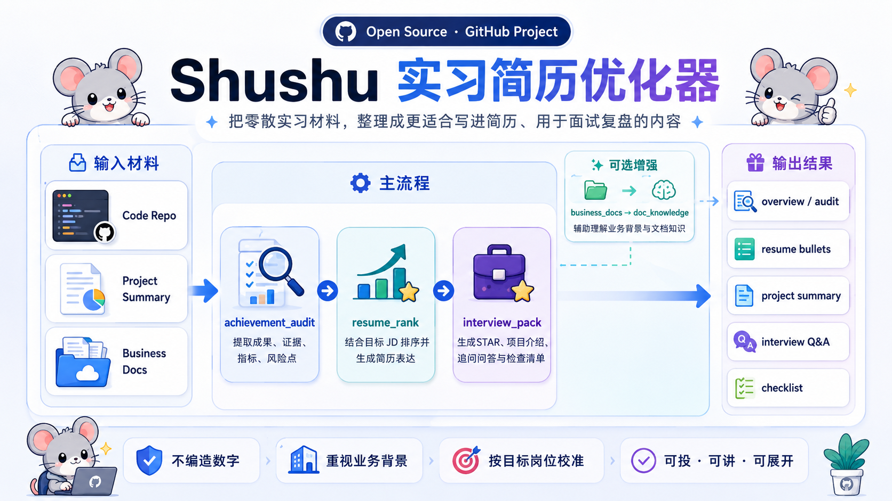

# Shushu Internship Resume Optimizer

**Turn scattered internship materials into resume-ready bullets and interview-ready project stories.**

Shushu audits achievements and evidence first, ranks them against a target JD, and then generates resume bullets, project summaries, STAR drafts, interview Q&A, and risk checklists.

[简体中文](./README.md) · [English](./README.en.md) · [Contributing](./CONTRIBUTING.md) · [Release Notes](./RELEASE_NOTES.md)



> ⚠️ Sanitize first: do not upload company-internal docs, real user data, keys, tokens, or any internship material that cannot be shared externally.

## Quick Links

- [Run The Demo First](#3-minute-demo)
- [See Sample Outputs](#what-the-output-looks-like)
- [See Recent Updates](#recent-updates)
- [Use Your Own Materials](#use-your-own-materials)
- [Naming Notes](#naming-notes)
- [Read The Security Reminder](#security-reminder)

## Recent Updates

The workflow has recently been tightened around a `model-first, script-second` direction.

- `achievement_audit` now prefers `structured_extract_path` or inline `structured_extract` whenever you provide them in `sources.json`
- if a structured extract is present in the same run, plain `business_docs` are treated as business-context support instead of generating extra achievement candidates that can pollute the main flow
- `resume_rank` has been simplified away from sample-specific title mappings and now relies more on structured fields such as `task`, `actions`, `metrics`, and `business_value`
- `interview_pack` now accepts `resume_rank.json` directly via `ranked_achievements`, so the end-to-end handoff is stable

If you are integrating your own materials, the recommended order is now:

1. Prepare a clean `project_summary.md` or equivalent raw notes.
2. If the material is long or semantically dense, add a `structured_extract.json`.
3. Wire that file into `sources.json` with `structured_extract_path`.
4. Let `business_docs` focus on business context and workflow framing.

## What Problem It Solves

Many internship materials are not weak. They are just scattered:

- the implementation exists in the repo, but the contribution boundary is unclear in the resume
- project notes are long, but not ready to compress into resume bullets
- the details are there, but the project story is hard to explain consistently in interviews
- direct AI summarization often becomes vague, repetitive, overclaimed, or weakly supported

This project is not meant to blindly generate a resume for you. It first audits the raw material, extracts evidence, flags risks, and highlights gaps, then turns that into application-facing material that is easier to verify and rewrite manually.

## Why Use It

- not a blind resume generator: it extracts evidence, metrics, and contribution boundaries before rewriting
- not a one-size-fits-all template: it ranks achievements against a target JD
- not repo-only: it supports `code_repo`, `project_summary`, and `business_docs`
- not hype-driven: it flags AI-heavy, risky, or user-check-required statements
- not just for resumes: it also generates project intros, STAR drafts, interview Q&A, and application checklists

## 3-Minute Demo

Environment requirement: `Python >= 3.10`

The repository includes a minimal public example input set so you can validate the workflow and output shape before plugging in your own local materials.

Example files:

- `examples/minimal_input/sources.json`
- `examples/minimal_input/project_summary.md`
- `examples/minimal_input/business_overview.md`
- `examples/minimal_input/target_jd.txt`

```bash
git clone https://github.com/Sunanzhe2004/shushu-internship-resume-optimizer.git
cd shushu-internship-resume-optimizer

python -m venv .venv
```

macOS / Linux:

```bash
source .venv/bin/activate
python -m pip install -e ".[dev]"

python -m shushu_internship_tool.achievement_audit \
  --sources examples/minimal_input/sources.json \
  --out demo_reports/audit \
  --name demo-materials

python -m shushu_internship_tool.resume_rank \
  --jd examples/minimal_input/target_jd.txt \
  --achievements demo_reports/audit/achievement_audit.json \
  --target-role llm-application-intern \
  --out demo_reports/rank

python -m shushu_internship_tool.interview_pack \
  --project-notes demo_reports/rank/resume_rank.json \
  --target-role llm-application-intern \
  --out demo_reports/interview
```

Windows PowerShell:

```powershell
.\.venv\Scripts\Activate.ps1
python -m pip install -e ".[dev]"

python -m shushu_internship_tool.achievement_audit `
  --sources examples/minimal_input/sources.json `
  --out demo_reports/audit `
  --name demo-materials

python -m shushu_internship_tool.resume_rank `
  --jd examples/minimal_input/target_jd.txt `
  --achievements demo_reports/audit/achievement_audit.json `
  --target-role llm-application-intern `
  --out demo_reports/rank

python -m shushu_internship_tool.interview_pack `
  --project-notes demo_reports/rank/resume_rank.json `
  --target-role llm-application-intern `
  --out demo_reports/interview
```

Look at these first after the run:

- `demo_reports/audit/overview.md`
- `demo_reports/rank/resume_project_summary.md`
- `demo_reports/interview/interview_qa.md`

## What The Output Looks Like

These are illustrative snippets meant to help a GitHub visitor quickly judge whether the outputs feel useful, editable, and interview-ready.

### `resume_project_summary.md` sample

```md
- Built an achievement-audit workflow for multi-source internship materials, combining repos,
  project notes, and business context into reusable evidence-backed achievement candidates.
- Ranked achievements against a target JD so the resume-facing version highlights business understanding,
  implementation depth, and measurable impact before lower-signal details.
- Added explicit risk reminders for AI-heavy wording, unsupported claims, and unclear ownership boundaries
  to reduce “sounds polished but collapses under follow-up questions” cases.
```

### `interview_qa.md` sample

```md
Q: What was your most important contribution in this project?
A: My core contribution was not generating a resume directly. It was building a workflow that
   breaks raw materials into achievements, evidence, and risk layers first, so later summaries
   stay verifiable and easier to defend in interviews.

Q: Why add risk reminders at all?
A: Because many AI-generated summaries sound smooth but become vague, overclaimed, or weakly supported.
   I wanted the tool to surface what must be checked by the user before it reaches the resume.
```

### What `overview.md` usually contains

- extracted achievements with evidence, metrics, business context, and missing information
- `user_check_flags` to mark lines that need explicit user confirmation
- a structure better suited for review first and resume compression second

## Workflow

Main flow:

`JD + multi-source internship materials -> achievement_audit -> resume_rank -> interview_pack`

Optional enhancement:

`business_docs -> doc_knowledge`

Recommended order:

1. Prepare `sources.json` with repo paths, project notes, and business docs.
2. Prefer a structured extraction file for dense project notes, then point `structured_extract_path` to it from the corresponding `project_summary` source.
3. Run `achievement_audit` to inspect extracted achievements, evidence, and risk flags.
4. Run `resume_rank` to see which achievements best fit the target role.
5. Run `interview_pack` to convert the result into STAR material, project intros, and interview Q&A.

## Use Your Own Materials

The most common end-to-end flow is:

```bash
python -m shushu_internship_tool.achievement_audit --sources your_materials/sources.json --out reports/audit --name internship-materials
python -m shushu_internship_tool.resume_rank --jd your_materials/target_jd.txt --achievements reports/audit/achievement_audit.json --target-role llm-application-intern --out reports/rank
python -m shushu_internship_tool.interview_pack --project-notes reports/rank/resume_rank.json --target-role llm-application-intern --out reports/interview
```

Recommended `sources.json` pattern for model-first extraction:

```json
{
  "sources": [
    {
      "source_type": "project_summary",
      "path_or_text": "your_materials/project_summary.md",
      "title": "GUI Agent intern summary",
      "structured_extract_path": "your_materials/structured_extract.json"
    },
    {
      "source_type": "business_docs",
      "path_or_text": "your_materials/business_overview.md",
      "title": "business overview",
      "knowledge_mode": "basic_rag"
    }
  ]
}
```

For the minimal input structure, see [examples/minimal_input](./examples/minimal_input/):

- `sources.json`: input index that ties repos, summaries, and business docs together
- `project_summary.md`: a long raw summary is fine; the tool is meant to break it down first
- `business_overview.md`: useful for business context, upstream/downstream flow, and problem framing
- `target_jd.txt`: used for ranking and wording calibration


If you also want lightweight business-doc querying, run:

```bash
python -m shushu_internship_tool.doc_knowledge --docs your_materials/business_overview.md --mode basic_rag --query "What are the main failure modes?" --out reports/knowledge
```

## Naming Notes

- repo name: `shushu-internship-resume-optimizer`
- Python package: `shushu-internship-tool`
- module path: `shushu_internship_tool`
- console scripts: `shushu-achievement-audit`, `shushu-resume-rank`, `shushu-interview-pack`
- recommended README run style: `python -m shushu_internship_tool.xxx`

This keeps the current package layout stable. If naming is unified later, it will be called out clearly in the release notes.

## Command Details

### 1. Achievement Audit

```bash
python -m shushu_internship_tool.achievement_audit --sources your_materials/sources.json --out reports/audit --name internship-materials
```

Outputs:

- `achievement_audit.json`
- `overview.md`
- `overview.html`
- `business_context_rewrite.md`

This stage also handles:

- splitting a long project summary into multiple achievement candidates
- extracting metrics, evidence, risks, and missing support
- adding `user_check_flags` for AI-heavy, unclear-boundary, or likely-overclaimed statements
- generating a cleaner business-context rewrite for self-review and interview prep

### 2. Resume Ranking

```bash
python -m shushu_internship_tool.resume_rank --jd your_materials/target_jd.txt --achievements reports/audit/achievement_audit.json --target-role llm-application-intern --out reports/rank
```

Outputs:

- `resume_rank.json`
- `resume_rank.md`
- `resume_project_summary.md`

This stage also suggests:

- more resume-like bullet wording
- which metrics are most worth adding
- what evidence or implementation detail is still missing
- which lines sound too mechanical, repetitive, or overly AI-generated

### 3. Business Doc Knowledge Layer

```bash
python -m shushu_internship_tool.doc_knowledge --docs your_materials/business_overview.md --mode basic_rag --query "How does the workflow recover failures?" --out reports/knowledge
```

Supported modes:

- `direct`
- `basic_rag`
- `knowledge_base`

### 4. Interview Pack

```bash
python -m shushu_internship_tool.interview_pack --project-notes reports/rank/resume_rank.json --target-role llm-application-intern --out reports/interview
```

Outputs:

- `interview_pack.json`
- `resume_star.md`
- `project_intro.md`
- `interview_qa.md`
- `risk_answers.md`
- `application_checklist.md`

## Current Status

Relatively stable:

- multi-source achievement audit
- JD-based achievement ranking
- resume project summary generation
- interview Q&A and STAR draft generation

Still being strengthened:

- the `doc_knowledge` layer
- broader role and industry samples
- finer-grained AI-heaviness and overclaim detection
- fuller test coverage

## Design Principles

- do not fabricate metrics
- make missing evidence explicit
- value business context, not just code
- calibrate writing style to the target role
- explicitly warn about AI-heavy or overclaimed phrasing
- optimize for material that is usable in applications, interviews, and follow-up questions

## Credits And Upstream

This repository is a scenario-focused secondary development and restructuring built on top of the original project, with the current version centered on internship resume preparation and interview review.

Current primary flow:

`achievement_audit -> resume_rank -> interview_pack`

Optional supporting capability:

`doc_knowledge`

Thanks to the original project author for the upstream workflow and foundation:

- `https://github.com/LiuMengxuan04/shushu-internship-tool`

## Contributing

If you want to improve extraction quality, resume rewriting, interview phrasing, testing coverage, or docs, please read [CONTRIBUTING.md](./CONTRIBUTING.md) first. Issues and PRs are both welcome.

## Security Reminder

When using this project with internship materials, project notes, or business documents, please follow your company's security and confidentiality rules carefully.

In particular, do not upload, commit, or publish:

- non-anonymized internal business data
- internal company documents, strategies, or workflow details
- materials containing user data, credentials, keys, or tokens
- any internship content that is explicitly not allowed to be shared externally

If you want to test the project, it is strongly recommended to use sanitized materials or manually rewritten summaries first.
